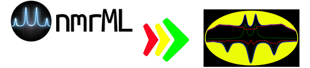

# nmrML2BATMAN
Version: 1.0

## Short Description
This tool converts zipped nmrML (Bruker) files into tabulated txt file for BATMAN.

## Description

## Key features
- Format Converter

## Functionality

- Format Converter for BATMAN

## Approaches

- Metabolomics
  
## Instrument Data Types

- NMR / 1D NMR

## Tool Authors 

- Jianliang and Vagelis (Imperial College London)
- nmrML Standards Group

## Container Contributors

- Jianliang and Vagelis

## Git Repository

- https://github.com/phnmnl/container-nmrML2BATMAN.git

## preparation for zipped nmrML file
Use the tool from 
https://github.com/nmrML/nmrML/tree/master/tools/Parser_and_Converters/Java/converter/bin

and run 

Example under Windows 7 / Cygwin
`for d in `ls ./mesa/`; do 
      C:/Workdir/COSMOS/Converter/dist/bin/nmrMLcreate -b -z -i ./mesa/$d   | \
     C:/Workdir/COSMOS/Converter/dist/bin/nmrMLproc -b -z -d ./mesa/$d/pdata/1 \ 
             -o mesa-$d.nmrML
 done`

In this example, we save bruker raw data in the directory "mesa". 

The command lines will generate a list of nmrML files, named as mesa-xxxx.nmrML, 

where xxxx takes names of folders of Bruker raw data in the "mesa" directory.
 
## Installation

in the folder where Dockerfile is hosted and run
`docker build -t <your_docker_image_name>:latest .`

## Usage Instructions
Download the test data from test_data and unzip it into <path/to/data/folder>

OR copy the nmrML files generated by the above command lines in the example to <path/to/data/folder>

Change work dir to <path/to/data/folder> and run

`docker run -v $PWD:/data -ti <your_docker_image_name> -i /data/`

### Galaxy usage

A rudimentary Galaxy node description is included as `nmrml2batman.xml`.
